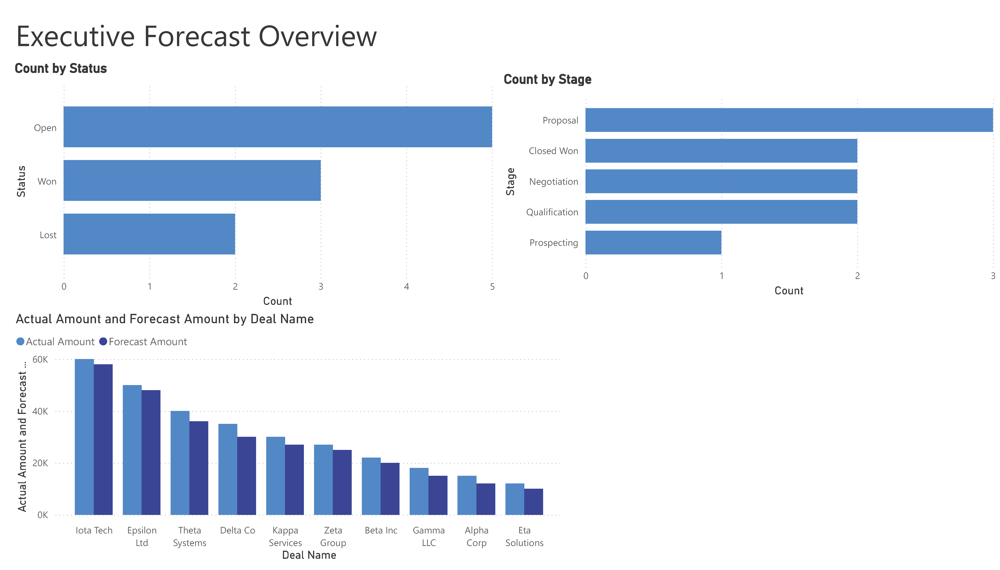
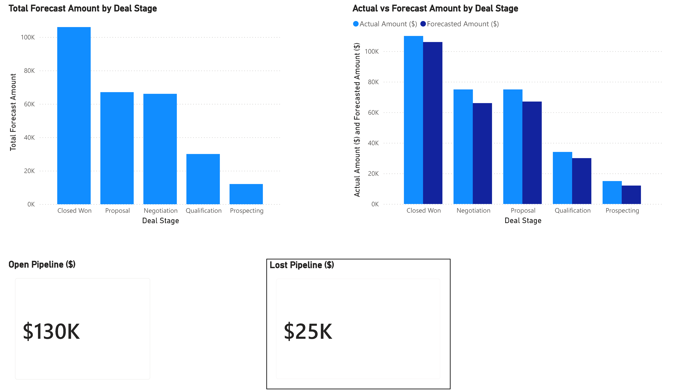

# Sales Pipeline & Forecast Accuracy Analysis
## Executive Overview

## Forecast vs Actual

## At-Risk Deals by Stage

Sales pipeline and forecast accuracy analysis using SQL queries and Power BI dashboards to identify pipeline health, stalled deals, and forecasting improvement opportunities.

---

## Project Overview

This project analyzes CRM-style sales pipeline data to evaluate forecast accuracy, pipeline health, and deal progression. The goal is to demonstrate practical Sales Operations and data analysis skills by transforming raw deal data into actionable insights that support forecasting accuracy and revenue decision-making.

---

## Business Questions

- How does actual revenue compare to forecasted revenue over time?
- Which pipeline stages contribute most to forecast inaccuracy?
- Where are deals stalling in the pipeline?
- What operational changes could improve forecast accuracy and decision-making?

---
 ## Tools Used
- **Power BI** – Design and delivery of executive dashboards supporting forecast accuracy, pipeline health, and sales performance  
- **SQL** – Analytical querying (joins, aggregations, filtering) to model and prepare CRM-style sales data for reporting  
- **Excel / Power Query** – Data validation, normalization, and transformation to ensure data integrity and reporting accuracy
---

## Methodology & Assumptions

- Modeled deal progression using stage entry dates to analyze time spent in each pipeline stage.
- Calculated forecast variance at both the deal and stage level.
- Identified stalled deals based on extended time-in-stage (greater than 45 days).
- Analyzed stage-level volume and outcomes to assess pipeline efficiency and risk.

---

## Key Insights

- Late-stage opportunities drive the majority of forecast variance.
- Deals stalled longer than 45 days show a strong correlation with reduced forecast accuracy.
- Certain pipeline stages contain high deal volume but below-average win rates, indicating process inefficiencies.

---

## Recommendations

- Standardize stage exit criteria for late-stage opportunities to improve forecast reliability.
- Proactively flag stalled deals for weekly pipeline review.
- Improve pipeline hygiene by enforcing regular close-date updates.

---

The dashboards above provide executive-level views of forecast accuracy, pipeline health, and at-risk opportunities, supported by SQL-based analysis of CRM-style sales data.